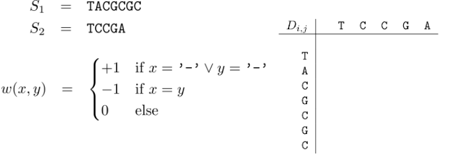

Albert-Ludwigs-Universität Freiburg

Lehrstuhl für Bioinformatik - Institut für Informatik - *http://www.bioinf.uni-freiburg.de*

Course ILIAS web page: *https://ilias.uni-freiburg.de/ilias.php?ref_id=2339316&cmdClass=ilobjcoursegui&cmd=view&cmdNode=zf:ns&baseClass=ilRepositoryGUI*

---
## Bioinformatics 1
###### WS 2021/2022
##### Exercise sheet 3: Sequence Alignment
---

### _Exercise 1 -  Alignments_

For the given examples which ones can be called alignments:


**a)**
 
    AGTTTTTT
    AGGTTTTT
    
    
**b)**
 
    CCGTTTTTT
    -AGGTTTTT
    
    
    
**c)**
 
    CCCGTTTTTTGC
    -CGGTTTTT
    
    
**d)**
 
    AG--TTTTTT
    AG-GTTTTTT


### _Exercise 2 -  Hands on Needleman-Wunsch algorithm_

The Needleman-Wunsch algorithm enables the calculation of the optimal pairwise sequence alignment with linear gap cost. Given the following two sequences S1, S2 and the given cost function complete the tasks **a-d**.

<br>
<p align="center">

 </p>

**a)** Complete the provided table with the correct initialization step


**b)** Using dynamic programming technique fill in all values in the matrix


**c)** Using the matrix from **b)** find the optimal alignment of the given sequences

**d)** Find the optimal alignment of the given sequences,
while assuming that the first G character in each sequence has to be matched/aligned

### _Exercise 3 - Hirschberg recursion and Needleman-Wunsch algorithm_

Which statements about Needleman-Wunsch and the Hirschberg recursion are True and 
which are False

 - [ ] Hirschberg computes global alignment in O(n²) space
 - [ ] Needleman-Wunsch computes global alignment in O(n²) time
 - [ ] The Hirschberg recursion is a space optimized version of the Needleman-Wunsch algorithm
 - [ ] Hirschberg computes global alignment in O(n) time


### _Exercise 4 - Programming assignment: Implementation of Needleman-Wunsch algorithm_

---
**NOTE**

The programming assignment will use a scoring function as parameters which is a dictionary with 3 entries. 
This will look as follows:

scoring = {"match": -1,
               "mismatch": 1,
               "gap_introduction": 0}

You do not need to write the scoring function by yourself. However, make sure you use the correct keys in your implementation.
An example will be provided in the skeleton of part a). Despite most implementations of Needleman Wunsch will use a
maximization at the optimization step, we will stick to the lecture and use minimization. (score(match) < score(gap))
Also have a look at return typehints in the skeleton functions and read carefully how the results should be returned.

---

**a)** Implement the function zero_init() which takes two sequences S1 and S2 and creates the Needleman-Wunsch matrix and initiates all the matrix values with zeroes.
Hereby S1 should be represented by the rows and S2 by the columns.


**b)** Implement the function nw_init() which takes two sequences S1 and S2 as well as the scoring function and fills in the values for the first row and first column of the matrix with the correct values.
Utilize **a)** in your implementation.

**c)** Implement the function nw_forward() which takes the two sequences S1 and S2 and the scoring function and output the complete matrix filled with the Needleman-Wunsch approach.

The following steps will help you with implementing the traceback.

**d)** Implement the function previous_cells() which takes two sequences S1 and S2, scoring function, the filled in recursion matrix from the step **c)** and the cell coordinates as a tuple (row, column).
The function should output a list of tuples of all possible previous cells. The tuples should be again structured like
(row, column).

**e)** Implement the function which builds all possible traceback paths. This function should return a list of possible paths which
themselves are a list of tuples (row, column). The ordering must be decreasing. Meaning paths should start in the lower
right corner of the matrix.

**f)** Implement the function build_alignment() which takes two sequences and a path as a list of tuples. This function
should return an alignment tuple. Meaning two strings of same length with introduced gaps. 

### _Preparing for the Exam_

The [exercise_sheet3.py](./exercise_sheet3.py) file provides the possibility to create training examples for the exam.
You can just edit the two sequences and the scoring scheme at the bottom of the file:

```python
if __name__ == "__main__":
    seq1 = "AT"
    seq2 = "CTAT"
    scoring = {"match": -1, "mismatch": 0, "gap_introduction": 1}

    nw_init_csv_maker(seq1, seq2, scoring)
```

and run it via the command line:

```shell
python exercise_sheet3.py
```

This will produce a csv file that you can import into excel, libre office calc, etc., where you
can fill in the forward values by yourself. To check if you provided the correct result, you
can go to the [test_exercise_sheet3](./tests/test_exercise_sheet3.py) enter the same sequence and 
scoring and run it similarily:

```shell
python tests/test_exercise_sheet3.py
```


