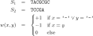

Albert-Ludwigs-Universität Freiburg

Lehrstuhl für Bioinformatik - Institut für Informatik - *http://www.bioinf.uni-freiburg.de*

---
## Bioinformatics 1
###### WS 2021/2022
##### Exercise sheet 3: Sequence Alignment
---

### _Exercise 1 -  Alignments_

For the given examples which ones can be called alignments:

**a)**
 
    AGTTTTTT
    AGGTTTTT
    
    
**b)**
 
    CCGTTTTTT
    -AGGTTTTT
    
    
    
**c)**
 
    CCCGTTTTTTGC
    -CGGTTTTT
    
    
**d)**
 
    AG--TTTTTT
    AG-GTTTTTT

### _Exercise 2 -  Hands on Needleman-Wunsch algorithm_

The Needleman-Wunsch algorithm enables the calculation of the optimal pairwise sequence alignment with linear gap cost. Given the following two sequences S1, S2 and the given cost function complete the tasks **a-d**.

#TODO add the matrix into the readme

**a)** Complete the provided tables with the correct initialization step

**b)** Using dynamic programming technique fill in all values in the matrix

**c)** Using the matrix from **b)** find the optimal alignment of the given sequences

### _Exercise 3 - Programming assignment: Implementation of Needleman-Wunsch algorithm_

**a)** Implement the function zero_init() which takes two sequences S1 and S2 and creates the Needleman-Wunsch matrix and initiates all the matrix values with zeroes

**b)** Implement the function nw_init() which takes two sequences S1 and S2 as well as the scoring function and fills in the values for the first row and first column of the matrix with the correct values.
Utilize **a)** in your implementation.

**c)** Implement the function nw_forward() which takes the two sequences S1 and S2 and the scoring function and output the complete matrix filled with the Needleman-Wunsch approach.

The following steps will help you with implementing the traceback.

**d)** Implement the function previous_cells() which takes two sequences S1 and S2, scoring function, the filled in recursion matrix from the step **c)** and the cell coordinates (row, column).
The function should output the tuple of all possible cell previous cells.

**e)** Implement the function which builds all possible traceback paths. 

**f)** Implement the function build_alignment() which takes two sequences and outputs the alignment.

